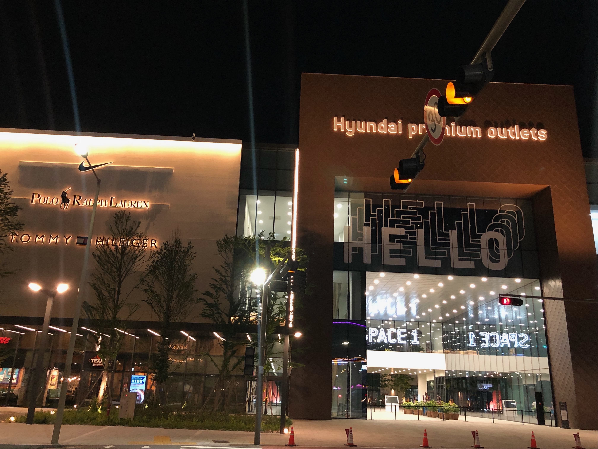
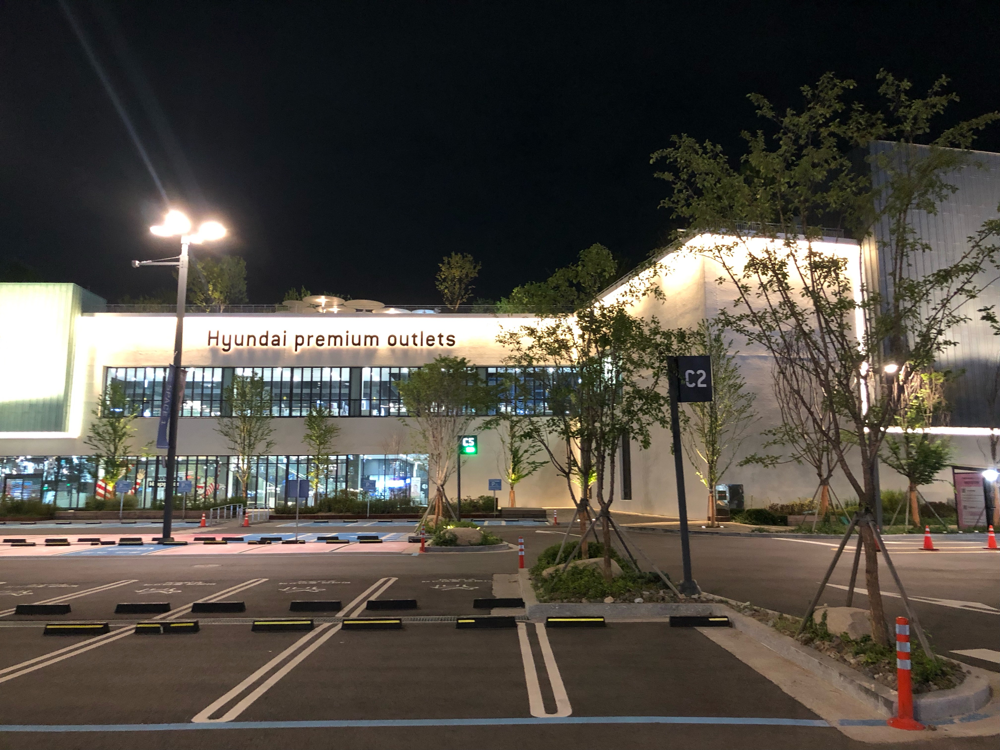
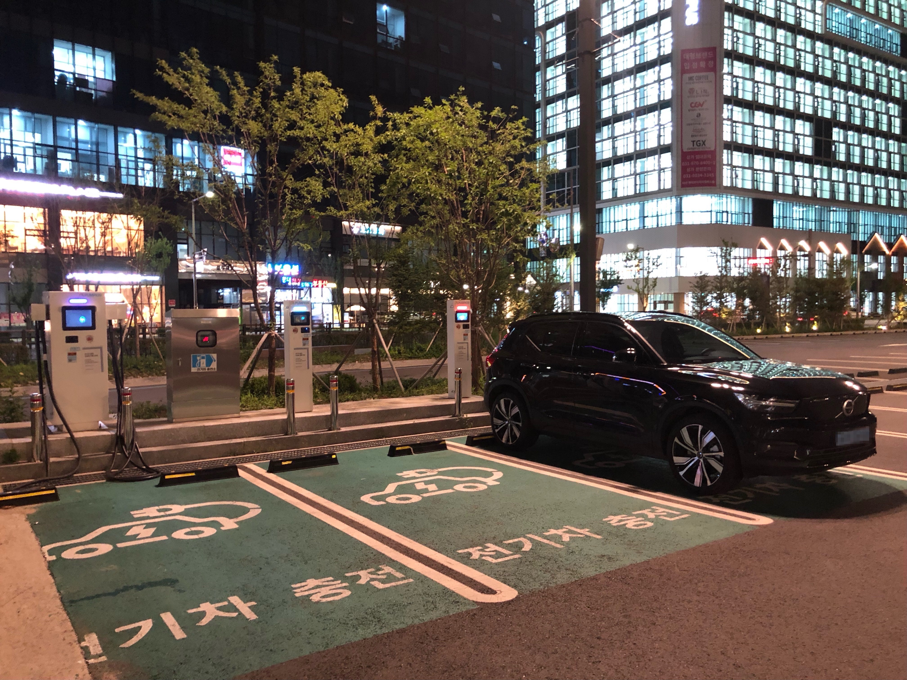
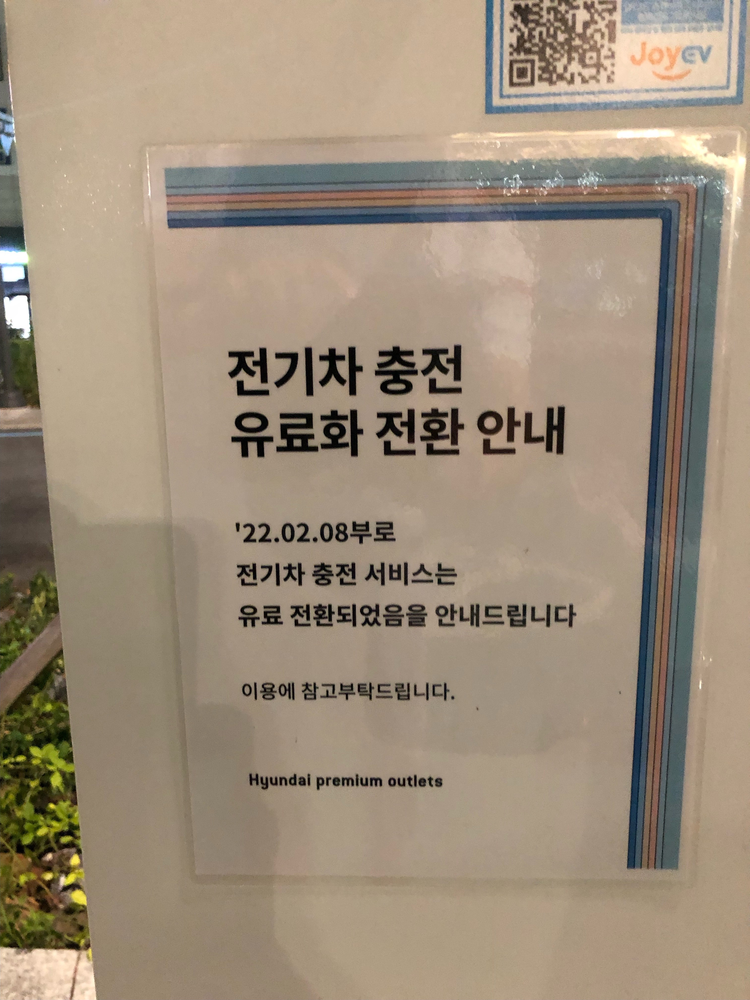
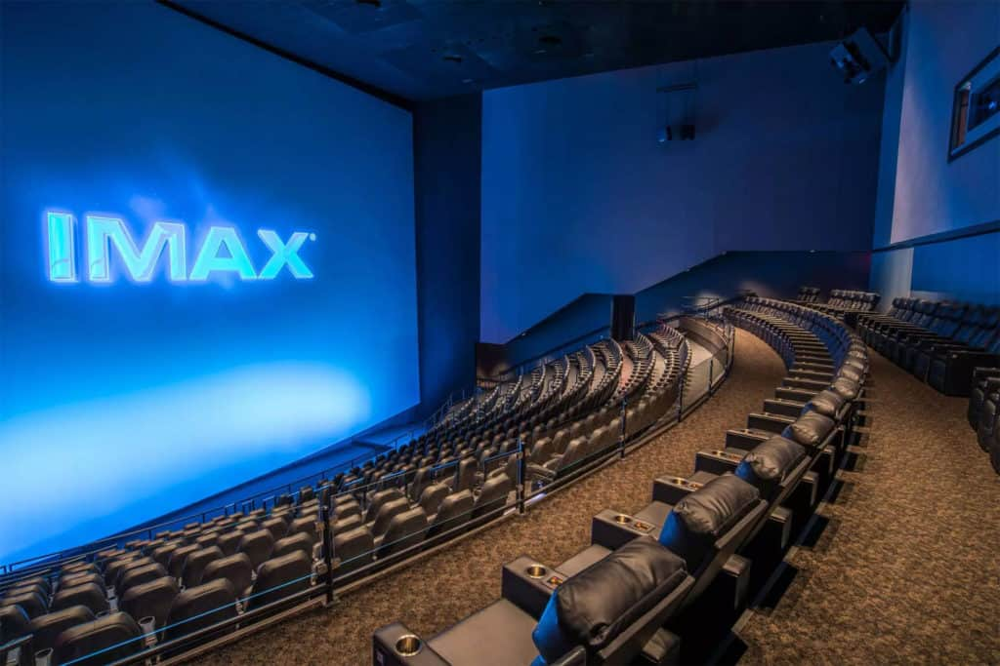
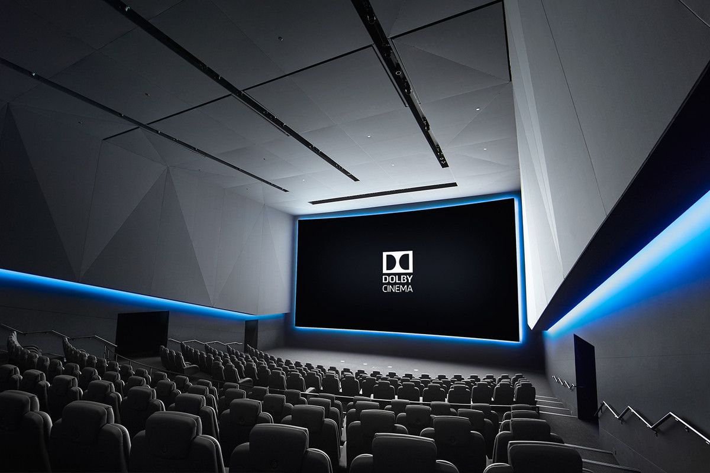

얼마전 돌비시네마 방문차 남양주 현대 프리미엄 아울렛 스페이스원에 다녀왔습니다.

전기차 충전소는 지상 주차장과 지하 주차장 지하1층에 있는데 저는 지상 주차장을 추천합니다. 스페이스원 영업 시간 이후에는 지상 주차장만 이용할 수 있는데 주차비가 무료입니다. 

지상 주차장 C2 지역 부근에 충전소가 있으며 보시다시피 야간에 주차장은 아주 널널합니다.

 

지상 주차장에 충전기는 3대 있으며, 한대는 급속 두대는 완속입니다. 그런데 완속 한대는(가운데) 충전 케이블이 없어서 케이블을 가지고 있어야 충전이 가능할 것 같네요. 

그리고 스페이스원 전기차 충전이 무료라는 이야기가 있어서 혹시나 하는 마음에 갔지만 아쉽게도 22년 2월 8일부로 유료로 전환됐네요. 충전 사업자는 [JoyEV](https://joyev.co.kr) 입니다. 미리 회원가입해서 카드를 발급 받아도 되고 저는 환경부 카드로 충전했습니다.

 

여기까지 서론이었고 이제부터 본론 😓

우선 탑건 매버릭을 1회차 광교 CGV IMAX에서 관람하고 2회차로 남돌비에서 관람했는데 돌비 시네마 압승입니다. 👍 완전히 다른 영화네요. 아이맥스 상영관이 화면이 커서 좋긴 하지만 탑건은 사운드가 아주 좋은 영화니 가능하시면 돌비 시네마에서도 꼭 관람해 보시기를 추천합니다~

