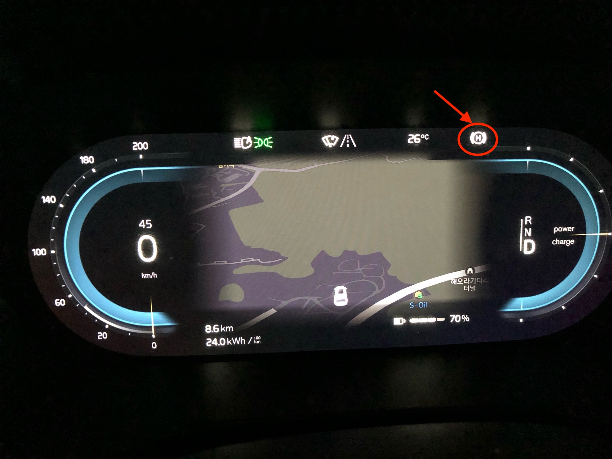

이번 7월 11일 볼보 차량의 소프트웨어가 v2.2 버전으로 업데이트됐습니다. XC40/C40 Recharge 모델은 OTA로 업그레이드 가능하며 변경 사항은 아래와 같습니다.

- Apple CarPlay 도입.
- Apple CarPlay 연결용 앞쪽 데이터 USB 포트 개방.
- 잘못된 "진입 불가" 교통 표지 경고의 비율 감소.
- 무선 충전을 포함하여 iPhone과의 호환성 개선.
- 구동 트레인 최적화 조정.
- 정지 시 브레이크(Hold)를 도입합니다. 즉, 신호등에서 차량이 정지할 때 제동을 유지하면서 운전자 화면에 홀드 심볼이 켜질 때 운전자가 브레이크 페달을 놓을 수 있습니다.

눈에 띄는 추가 기능은 CarPlay 와 오토 홀드(AUTO HOLD) 기능입니다.

## Apple CarPlay

CarPlay는 유선만 지원되는데 위 그림에서 흰색 테두리가 있는 포트에 연결해서 사용할 수 있습니다.

## AUTO HOLD

오토 홀드 기능은 차량 정차 후 브레이크를 꾹 밟아 주시면 아래와 같이 Ⓗ 표시가 생기면서 오토 홀드가 작동합니다.

액셀러레이터를 밟으면 차가 출발하면서 오토 홀드 기능이 해제됩니다. 오토 홀드는 신호 대기 등 짧은 정차시에만 사용하는 것이 좋습니다.

