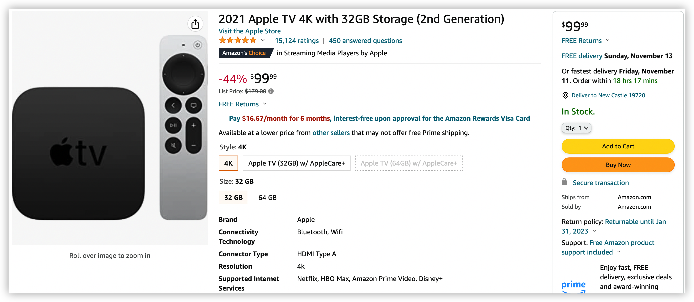
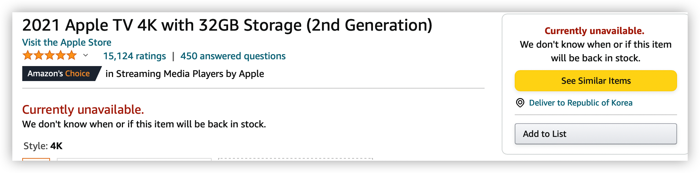

얼마 전에 Apple TV 4K 3세대가 출시되었는데요, 이에 미국 아마존에서 [2세대 모델](https://amzn.to/3WHlXpk)을 $99.99로 할인해서 판매하고 있습니다.

3세대 모델에 비해 저장 공간과(32GB vs 64GB,128GB) CPU가 차이 나지만(A12 vs A15) 스트리밍 서비스를 주로 이용한다면 큰 차이점을 느낄 수 없고 3세대 모델은 이더넷을 사용하려면 128GB 모델을 구입해야 하지만 2세대는 32GB 모델에도 이더넷 포트가 포함되어 있는 것이 장점입니다. 무엇보다도 환율이 올랐지만 $99.99 가격은 아주 메리트가 있습니다.

미국 아마존에서 구입 시 위 그림처럼 전원 플러그가 110V 용으로 제공되지만 모든 애플 기기가 그렇듯이 Apple TV도 110V/220V 모두 지원하기 때문에 별도의 변압기 필요 없이 돼지코만 구입해서 사용이 가능합니다. 전원 케이블이 분리형이기 때문에 [220V형 케이블](https://link.coupang.com/a/E66L7)을 따로 구매해서 사용해도 됩니다.

한국까지 직배는 안되고 배송 대행을 이용해야 합니다. 

참고로 위와 같이 `Currently unavailable`이라고 표시가 되는 경우가 있는데 이는 품절 상태가 아니라 지역 설정이 한국으로 되어 있어서 그렇습니다.

좌측 상단에 `Deliver to Republic of Korea`라고 되어 있는 부분을 클릭해서 주소를 미국 주소로 변경해 주시면 구입 가능한 상태로 변경이 됩니다.

Apple TV 4K 2세대(2021) 모델 구입하러 가기 👉 [클릭](https://amzn.to/3WHlXpk)

220V 2구(8자) AC 케이블 구입하러 가기  👉 [클릭](https://link.coupang.com/a/E66L7)

3세대 모델이 출시가 되었기 때문에 언제 2세대 모델이 단종될지 모르니 Apple TV 구입을 생각하고 계셨다면 할인할 때 구입하시는 것을 추천합니다.

> 이 포스팅은 Amazon Associates 활동의 일환으로, 이에 따른 일정액의 수수료를 제공받습니다.

