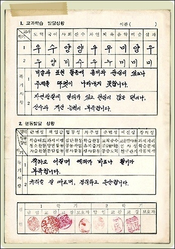

'수, 우, 미, 양, 가'에 대한 뜻을 알게 되었습니다. 

`수(秀)`는 빼어날 '수'자로 '우수하다'는 뜻이라고 합니다. 

`우(優)` '우등생' 할 때의 '우' 자로, 넉넉하다,도탑다는 말입니다. 역시 '우수하다'는 의미겠지요. 

'수'와 '우'가 큰 차이가 없다는 걸 알았습니다. 

`미(美)` 는 아시다시피, 아름다울 '미'이며 '좋다'는 뜻도 있습니다. 역시 잘했다는 의미입니다. 

`양(良)`은 '양호하다'의 양으로, 역시 '좋다', '어질다', '뛰어나다'의 뜻이 있습니다. 

말 그대로 '괜찮다'는 뜻이죠. 

성적의 다섯 등급에서 네 번째를 차지하는 '양'마저 좋은 뜻입니다. 

그리고 놀랍게도 `가(可)`는 '가능하다'고 할 때의 '가'로 '옳다'는 뜻을 가지고 있으며, 충분한 가능성을 가지고 있다는 말입니다. 

우리의 옛 선생님들의 성적표 작성법은 그 누구도 포기하지 않고 좋은 길로 이끌어 주시는 선생님들의 아름다운 사랑과 뜻이 담겨있었습니다. 

